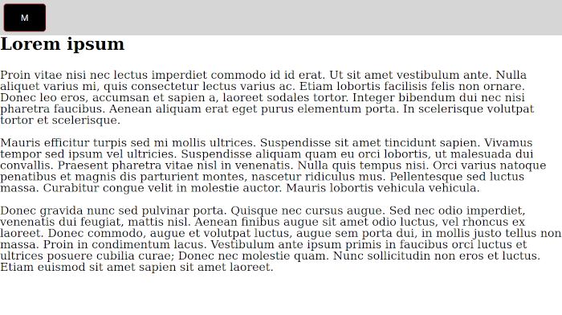

# JS in the Real World

These are four little exercises I did in the course of the "JS in the Real World" module at [The Odin Project](https://www.theodinproject.com). They don't qualify as real "projects", but I decided nevertheless to put them up here, also because some of the code could be reused in other projects. Since the whole module is about JavaScript, styling is mostly reduced to a bare minimum.

## Dropdown Menu

- I implemented a solution on click and a solution on hover. Both work with applying a class "visible" on an element with the class "dropdown-menu".
- I learned more about positioning during this exercise. The dropdown needs to be absolutely positioned inside a positioned container. In this case, as long as offsets are not specified, the absolutely positioned element will respect previous siblings (that is, the toggler that will expand it), but not following siblings.
- The hover-solution is actually triggered by the container and not the "toggler-element". This is necessary to prevent the dropdown-menu from collapsing when the mouse moves onto it (and thus leaves the "toggler-element").

## Mobile Menu

- This solution works very similar to the dropdowns, via applying classes to collapse the main content and move the sidebar in. Here, the offset-property of the menu is manipulated to move it in.

## Slideshow

- The slideshow works like this: Basically it is a very long `div` with pictures that moves behind another `div` that acts as the "picture-frame".
- This means that the frame needs to be `overflow:hidden` and the slider has to arrange all the images in a row (or column) without wrapping.
- A counter that is increased or decreased when clicking a navigation element is used to manipulate the offset-property of the slider.

## Form validation

- Here JavaScript is used to implement custom client-side form validation.

## License

MIT
